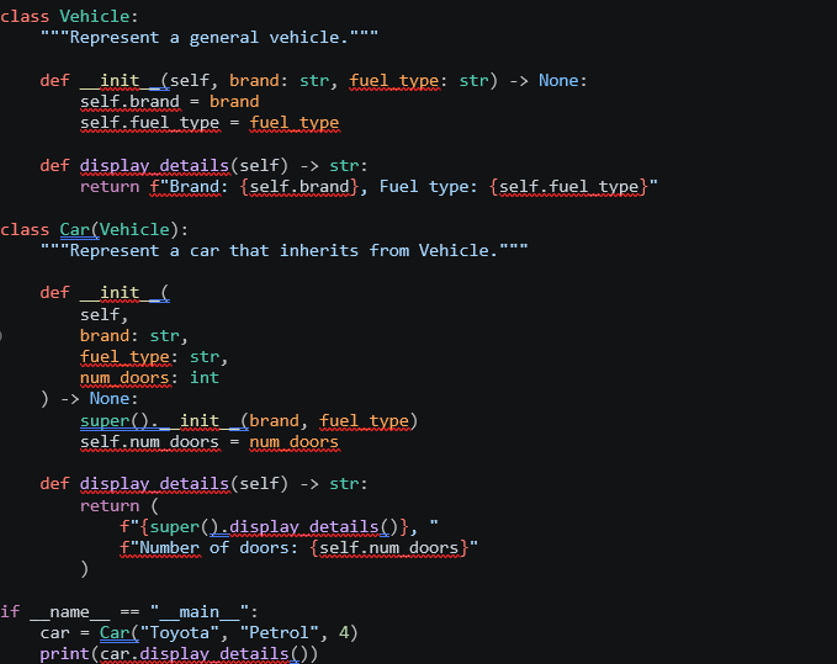
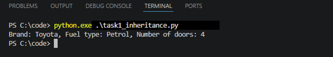
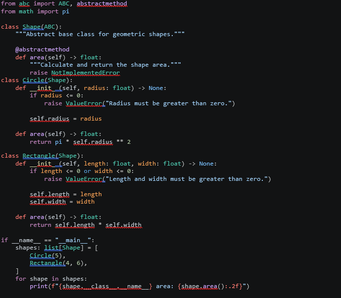
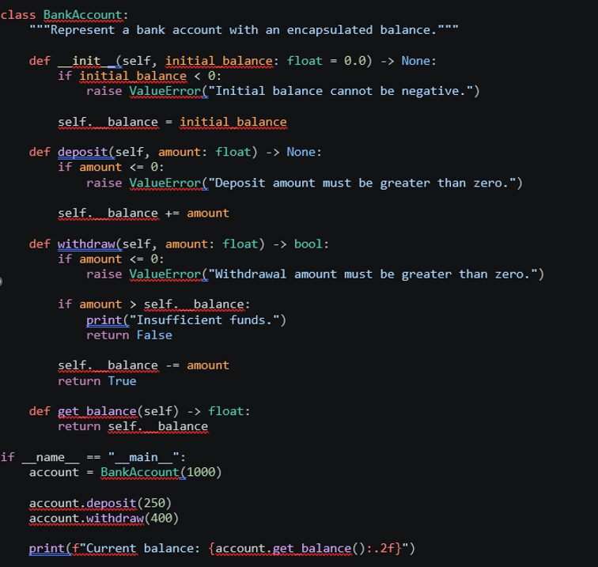
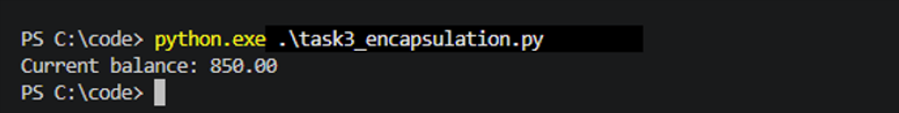
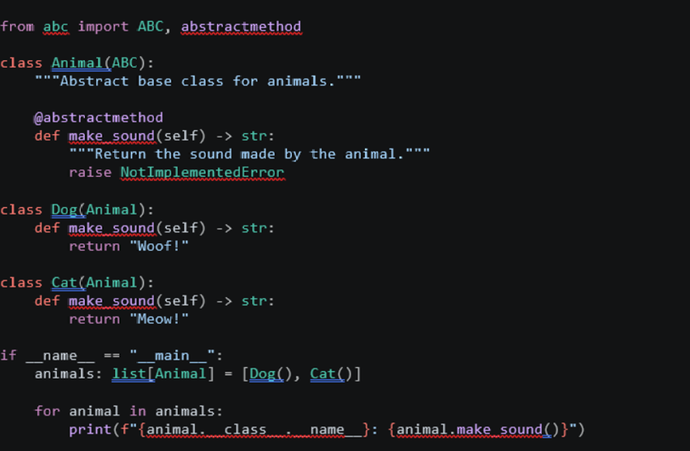
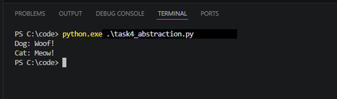
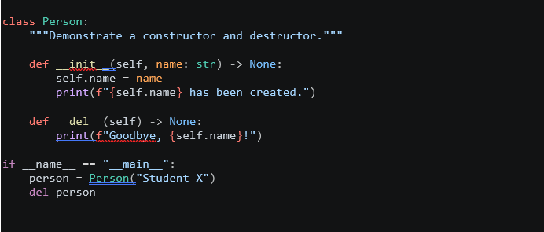
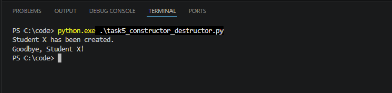

# Unit 1 – Introduction and Recap of Object-Oriented Programming

## Programming Exercise

The Unit 1 programming exercise contains five practical Python tasks, each demonstrating a core Object-Oriented Programming concept. The exercises cover **inheritance, polymorphism, encapsulation, abstraction, and object construction/destruction**.

The supporting source code and screenshots are organised as follows:

```text

├── code/
│   ├── task1_inheritance.py
│   ├── task2_polymorphism.py
│   ├── task3_encapsulation.py
│   ├── task4_abstraction.py
│   └── task5_constructor_destructor.py
└── images/
```

---

## Task 1 – Basic Class Hierarchy (Inheritance)

This task demonstrates **inheritance** by defining a general `Vehicle` class and a `Car` class that inherits from it. `Car` reuses the `brand` and `fuel_type` attributes from `Vehicle` and extends the class by adding `num_doors`.

The example shows how inheritance can reduce duplication and create a logical relationship between a general class and a more specialised class.

**Source code:** [`task1_inheritance.py`](code/task1_inheritance.py)



The program creates a Toyota car using petrol with four doors. The output confirms that the inherited vehicle information and the additional car-specific attribute are displayed correctly.



---

## Task 2 – Polymorphism with Methods

This task demonstrates **polymorphism** using an abstract `Shape` class with an `area()` method. `Circle` and `Rectangle` both implement the same method, but each class calculates its area differently.

This shows how objects with a common interface can respond to the same method call according to their own implementation.

**Source code:** [`task2_polymorphism.py`](code/task2_polymorphism.py)



The program calculates the area of a circle with radius `5` and a rectangle with dimensions `4 × 6`. The results confirm that the same `area()` method produces different behaviour for each object type.


---

## Task 3 – Encapsulation with Access Control

This task demonstrates **encapsulation** using a `BankAccount` class. The balance is stored in the private `__balance` attribute and is accessed or modified only through controlled methods such as `deposit()`, `withdraw()`, and `get_balance()`.

Input validation is also included to reject invalid balances or transaction amounts.

**Source code:** [`task3_encapsulation.py`](code/task3_encapsulation.py)



The example starts with a balance of `1000`, deposits `250`, and withdraws `400`. The final balance is `850.00`, demonstrating controlled access to the private account balance.



---

## Task 4 – Abstraction with Base Class

This task demonstrates **abstraction** using an abstract `Animal` class. The base class defines the required `make_sound()` method, while the `Dog` and `Cat` classes provide their own implementations.

The abstract class defines the common structure without specifying the exact behaviour of every animal.

**Source code:** [`task4_abstraction.py`](code/task4_abstraction.py)



The execution shows that both concrete classes follow the same abstract interface while returning different sounds.

```text
Dog: Woof!
Cat: Meow!
```



---

## Task 5 – Constructor and Destructor

This task demonstrates object **initialisation and finalisation** using `__init__()` and `__del__()`.

The `Person` class uses `__init__()` to initialise the object's name when it is created. The `__del__()` method demonstrates behaviour associated with object finalisation when the object is explicitly deleted.

**Source code:** [`task5_constructor_destructor.py`](code/task5_constructor_destructor.py)



The execution confirms that the constructor runs when the `Person` object is created and the destructor runs after the object is deleted.



---

## How to Run the Exercises

Open a terminal in the `code` directory and run each Python file individually:

```bash
python task1_inheritance.py
python task2_polymorphism.py
python task3_encapsulation.py
python task4_abstraction.py
python task5_constructor_destructor.py
```

---

## Summary

These exercises provide a practical introduction to the main OOP concepts covered in Unit 1:

| Task | Concept | Main Demonstration |
|---|---|---|
| 1 | Inheritance | `Car` reuses and extends `Vehicle` |
| 2 | Polymorphism | `Circle` and `Rectangle` implement `area()` differently |
| 3 | Encapsulation | Private balance accessed through controlled methods |
| 4 | Abstraction | Abstract `Animal` class defines a common interface |
| 5 | Constructor / Destructor | Object initialisation and finalisation with `__init__()` and `__del__()` |

Together, the tasks demonstrate how Python classes can be structured to support reuse, controlled access, common interfaces, and clear object behaviour.
