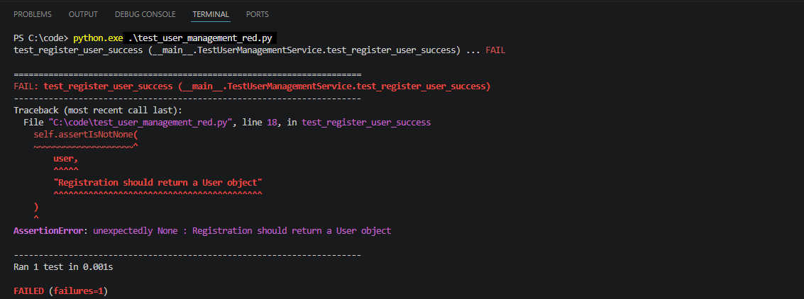
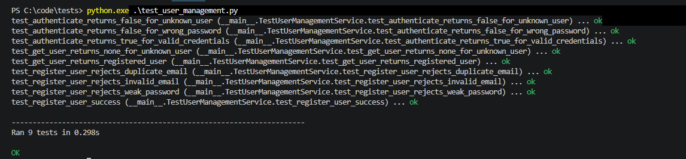

# Case Study Activity – Object-Oriented Software Architecture and TDD for an E-Learning Platform

## Activity Overview

The case study required the design, implementation and testing of a secure e-learning platform.

## Task 1 – Software Architecture

### Architecture Choice

The case study required the design, implementation and testing of a secure e-learning platform. I selected layered architecture because separating presentation, business logic and data access responsibilities provides a clear structure for maintaining and extending the system. It also supports security by keeping authentication and business rules separate from the presentation and data-storage responsibilities.

The proposed business modules are User Management, Course Management and Enrolment Management. This modular structure allows individual parts of the platform to be developed and modified independently, while the separation between layers provides a foundation for scaling components as the system grows.

### High-Level Architecture Design

Figure 1 presents the proposed three-layer architecture for the e-learning platform. For this formative activity, only the User Management module was implemented and tested. Course Management and Enrolment Management remain part of the proposed architecture.

**Figure 1. Proposed high-level layered architecture for the e-learning platform**

**Note: Elements shown in red are part of the proposed architecture and are included for illustration only. They were not implemented in the current activity. The practical implementation focused on the User Management module.**

### Proposed Core Modules

**User Management**

- registration,
- authentication,
- user retrieval,
- credential validation.

**Course Management**

- course creation,
- course information,
- course updates.

**Enrolment Management**

- enrolling students,
- checking enrolment state,
- linking users and courses.

Only User Management is implemented in the current practical evidence.

## Task 2 – Object-Oriented Implementation

For the practical implementation, I selected the User Management module. The final UserManagementService provides register_user(), authenticate() and get_user().

The final implementation is available here:

- [user_management.html](https://ralemadi.github.io/MSc-Cyber-Security-e-Portfolio/advanced-oop/unit-10/Case%20Study%20Activity/code/user_management.html)

The focused Red-stage implementation is available here:

- [user_management_red.html](https://ralemadi.github.io/MSc-Cyber-Security-e-Portfolio/advanced-oop/unit-10/Case%20Study%20Activity/code/user_management_red.html)

## Secure User Management

The implementation validates email addresses, enforces a minimum 12-character password policy, prevents duplicate registration and stores password hashes generated using PBKDF2-HMAC-SHA256 with a unique random salt. Authentication uses constant-time comparison when verifying password hashes rather than comparing plaintext passwords.

## TDD and Unit Testing

The test suite defines the expected behaviour for all three public methods. It includes successful registration and authentication as well as failure conditions such as invalid email addresses, weak passwords, duplicate users, incorrect passwords and unknown users.

The final suite contains nine unit tests, and all tests pass successfully. In the final implementation, internal responsibilities such as email normalisation, password hashing and password verification are separated into focused private helper methods.

Meszaros (2007) identifies ease of maintenance as an important goal of automated testing and discusses organising and refactoring tests to keep them understandable and maintainable as the system evolves. In this activity, the tests are organised around the public behaviours of register_user(), authenticate() and get_user().

The final unit tests are available here:

- [test_user_management.html](https://ralemadi.github.io/MSc-Cyber-Security-e-Portfolio/advanced-oop/unit-10/Case%20Study%20Activity/tests/test_user_management.html)

## Sample of the TDD Cycle

To demonstrate the TDD sequence, register_user() is used as a focused example of the Red–Green–Refactor cycle. The sequence reflects the test-first approach described by Beck (2002), where failing tests are followed by working implementation and refactoring.

### Red – Failing Test

A single registration test was used to demonstrate the Red stage of TDD. The test was executed before the required registration behaviour was implemented. It failed because register_user() returned None rather than the expected User object, showing that the required behaviour had not yet been satisfied.

- [Red-stage test code](https://ralemadi.github.io/MSc-Cyber-Security-e-Portfolio/advanced-oop/unit-10/Case%20Study%20Activity/tests/test_user_management_red.html)

**Figure 2. Failing registration test demonstrating the Red stage of TDD.**

### Green – Passing Implementation

The required registration behaviour was then implemented and the tests were run again. The final execution shows all nine unit tests passing successfully, confirming that the implemented User Management behaviour satisfies the test suite.

**Figure 3. Successful execution of the final unit test suite demonstrating the Green stage.**

### Refactor – Improve Structure Without Changing Behaviour

After the required behaviour was working, the internal implementation was reorganised into focused private helper methods for email normalisation, password hashing and password verification. The full test suite was then run again to confirm that these internal changes did not alter the expected public behaviour. The final passing test results provide validation that the refactored implementation still satisfies the existing tests.

## Test Coverage

| Public Method | Test Coverage |
|---|---|
| `register_user()` | successful registration, invalid email, weak password, duplicate email |
| `authenticate()` | valid credentials, wrong password, unknown user |
| `get_user()` | registered user, unknown user |

The successful registration test also verifies that the plaintext password does not appear in the stored `password_hash`.

## Reflection

This activity helped me understand TDD as more than a testing technique. Defining expected behaviour first encouraged me to consider both successful and failure conditions before completing the implementation.

The Red–Green–Refactor exercise showed how tests can guide development and support safer refactoring. This is particularly useful in security-related software because behaviours such as input validation and authentication failures can be tested explicitly and rechecked after code changes, helping to reduce the risk of security regressions.

The activity also reinforced the relationship between modular design and testability. Focusing on the User Management service made its behaviour easier to test independently, while refactoring showed how internal code can change without altering expected behaviour. This reflects Freeman and Pryce (2009), who show how tests can help guide software behaviour and object-oriented structure.

## Professional Skills Development and Action Plan

This activity strengthened my ability to use unit tests throughout development rather than only as a final check.

In future development work, I intend to follow a more structured testing plan by defining expected behaviour and test cases early, covering both successful and failure conditions, and rerunning tests after code changes or refactoring. This will help me make testing a consistent part of the development process rather than an activity performed only at the end.

## References

- Beck, K. (2002) *Test Driven Development: By Example*. Boston, MA: Addison-Wesley.
- Freeman, S. and Pryce, N. (2009) *Growing Object-Oriented Software, Guided by Tests*. Boston, MA: Addison-Wesley.
- Meszaros, G. (2007) *xUnit Test Patterns: Refactoring Test Code*. Boston, MA: Addison-Wesley.
