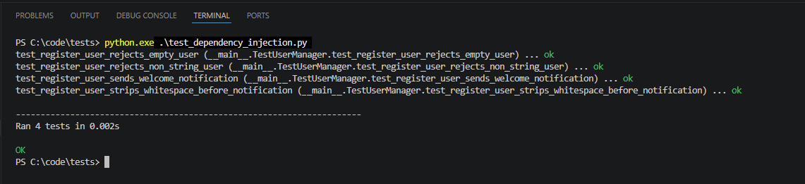

# Case Study Activity – Dependency Injection and Inversion of Control

## Activity Overview

The main practical activity required refactoring a simple Python application in which `UserManager` directly created an `EmailService`. This design created tight coupling because the notification dependency was fixed inside `UserManager`, and it also reduced testability because testing the manager depended on the real email service (Fowler, M. (2004) ; Freeman, S. and Pryce, N. (2010)).

The refactoring introduces a common notification abstraction and changes `UserManager` so that the required notification service is supplied from outside. This applies Dependency Injection and shifts control over dependency creation away from the class that uses the dependency (Martin, R.C. (2000)).

## Original Design Problem

The original implementation creates an `EmailService` directly inside `UserManager`. This makes the class depend on one concrete notification mechanism and makes it harder to replace email with another service such as SMS or push notifications (Martin, R.C. (2000)).

The tightly coupled design can be represented as:

```python
class EmailService:
    def send_email(self, user, message):
        print(f"Sending email to {user}: {message}")


class UserManager:
    def __init__(self):
        self.notifier = EmailService()

    def register_user(self, user):
        self.notifier.send_email(user, "Welcome!")
```

The two main issues are:

- **Tight coupling:** `UserManager` creates and controls a concrete `EmailService`.
- **Reduced testability:** testing `UserManager` is tied to the real notification implementation.

## Refactored Solution

The proposed refactoring introduces a `NotificationService` abstraction, implements that abstraction with `EmailService`, and modifies `UserManager` so that the notification dependency is passed into the constructor. This allows the same manager to work with different notification implementations without changing its internal registration logic (Gamma, E. et al. (1995)).

The implemented design includes:

- `NotificationService` as the abstraction.
- `EmailService` as a concrete implementation.
- `SMSService` as an alternative concrete implementation.
- `UserManager` using constructor injection.
- `Mock(spec=NotificationService)` during unit testing.

## High-Level Architecture Design

The following high-level architecture design illustrates how dependency creation is separated from business logic in the refactored solution. The `UserManager` depends on the `NotificationService` abstraction, while concrete services such as `EmailService` and `SMSService` are created externally and injected as required. During unit testing, a mock based on the `NotificationService` abstraction can be injected instead of a real notification service.


**Figure 1.** High-level architecture of the notification system using Dependency Injection and Inversion of Control.

## Testability

One of the main benefits of the refactoring is improved testability. Instead of using the real email service during a unit test, a mock notification service can be injected into `UserManager`. The test can then verify that the welcome notification was requested without actually sending an email (Fowler, M. (2004) ; Freeman, S. and Pryce, N. (2010)).

This keeps the unit test focused on `UserManager` and demonstrates how Dependency Injection supports testing components in isolation.

The final suite contains four tests covering:

- successful welcome-notification behaviour,
- whitespace normalisation,
- empty-user rejection,
- non-string input rejection.




## Artefacts

| Artefact | Purpose |
|---|---|
| [`code/dependency_injection.html`](https://ralemadi.github.io/MSc-Cyber-Security-e-Portfolio/advanced-oop/unit-11/Case%20Study%20Activity/code/dependency_injection.html) | Refactored notification design using abstraction, Email/SMS services and constructor injection |
| [`tests/test_dependency_injection.html`](https://ralemadi.github.io/MSc-Cyber-Security-e-Portfolio/advanced-oop/unit-10/Case%20Study%20Activity/code/tests/test_dependency_injection.html) | Mock-based unit tests of `UserManager` in isolation |
| [`test_results.txt`](https://ralemadi.github.io/MSc-Cyber-Security-e-Portfolio/advanced-oop/unit-10/Case%20Study%20Activity/code/test_results.txt) | Successful execution of the four unit tests |
| [`images/high-level_architecture.png`](images/high-level_architecture.png) | High-level DI/IoC architecture evidence |
| [`images/test_results.png`](images/test_results.png) | Visual unit-test evidence |

## Further Improvements

The case study also identifies possible extensions such as adding an `SMSService`, using a DI container to automate dependency wiring, and testing the real `EmailService` separately through integration testing (Fowler, M. (2004) ; Freeman, S. and Pryce, N. (2010)).

## Reflection

This unit helped me understand that coupling is not only about whether classes can communicate, but also about who controls the creation of their dependencies. When `UserManager` creates `EmailService` internally, changing or testing that dependency becomes more difficult (Fowler, M. (2004)).

Injecting the dependency makes the relationship explicit and allows different notification services to be supplied without changing the main user-management logic. I also recognised the connection between DI and earlier topics such as SOLID principles, software architecture and unit testing, because reducing direct dependencies can improve both extensibility and test isolation (Martin, R.C. (2000)).

## Professional Skills Development and Action Plan

In future development work, I intend to identify classes that create or tightly control their own external dependencies and consider whether those dependencies should instead be provided through constructor injection or another suitable DI approach. I will also use mocks where appropriate to keep unit tests focused and independent from external services (Fowler, M. (2004) ; Freeman, S. and Pryce, N. (2010)).


## References

- Fowler, M. (2004) ‘Inversion of Control Containers and the Dependency Injection pattern’. Available at: https://martinfowler.com/articles/injection.html
- Martin, R.C. (2000) ‘Design Principles and Design Patterns’. Object Mentor.
- Freeman, S. and Pryce, N. (2010) *Growing Object-Oriented Software, Guided by Tests*. Addison-Wesley.
- Gamma, E., Helm, R., Johnson, R. and Vlissides, J. (1995) *Design Patterns: Elements of Reusable Object-Oriented Software*. Addison-Wesley.
