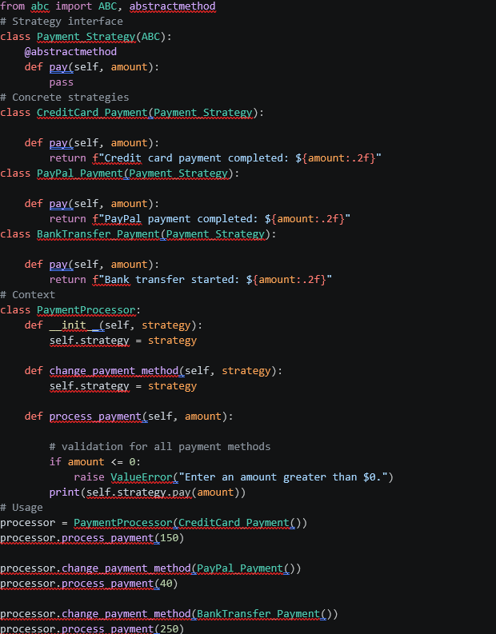
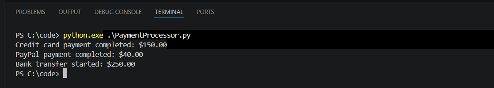

# Collaborative Discussion 2 – Strategy Pattern

## Overview

This collaborative discussion focuses on analysing and refactoring a simple payment-processing system using the **Strategy Pattern**.

The original design used an `if/elif` structure inside `PaymentProcessor` to select payment behaviour. Although this works for a small number of payment methods, the design becomes harder to maintain as additional payment options are introduced because each new method requires modifying the existing processor.

The refactored design moves each payment behaviour into a separate strategy class that implements a shared `Payment_Strategy` interface.


## Design Problem

The original implementation has two main issues:

- adding a new payment method requires modifying the existing `PaymentProcessor`
- `PaymentProcessor` needs to know the details of every payment method

This creates tight coupling and conflicts with the **Open/Closed Principle**, which encourages software behaviour to be extended without repeatedly modifying existing code.

## Strategy Pattern Refactoring

The refactored design introduces a common abstraction:

```python
class Payment_Strategy(ABC):
    @abstractmethod
    def pay(self, amount):
        pass
```

Concrete strategies implement the same interface:

- `CreditCard_Payment`
- `PayPal_Payment`
- `BankTransfer_Payment`

The processor stores a reference to the selected strategy:

```python
class PaymentProcessor:
    def __init__(self, strategy):
        self.strategy = strategy
```

The strategy can also be replaced at runtime:

```python
def change_payment_method(self, strategy):
    self.strategy = strategy
```

The actual payment operation is delegated to the selected strategy:

```python
print(self.strategy.pay(amount))
```

This separates the changing payment behaviour from the stable processor logic.

## Complete Implementation

**[Open Payment_Processor.html](code/Payment_Processor.html)**



## Shared Validation

Validation that applies to every payment method remains inside `PaymentProcessor`.

For example:

```python
if amount <= 0:
    raise ValueError("Enter an amount greater than $0.")
```

Keeping this rule in the processor avoids repeating the same validation inside every concrete strategy.

Method-specific validation can still be placed inside an individual strategy when a payment method has its own requirements.

## Runtime Strategy Change

The implementation demonstrates changing the payment method while the program is running:

```python
processor = PaymentProcessor(CreditCard_Payment())
processor.process_payment(150)

processor.change_payment_method(PayPal_Payment())
processor.process_payment(40)

processor.change_payment_method(BankTransfer_Payment())
processor.process_payment(250)
```

The same `PaymentProcessor` instance is reused while the payment behaviour changes through interchangeable strategy objects.

## Program Output

The three payment strategies are processed through the same `PaymentProcessor`.

Expected output:

```text
Credit card payment completed: $150.00
PayPal payment completed: $40.00
Bank transfer started: $250.00
```



## Result

The implementation successfully processes all three payment methods through the same processor.

The selected payment method changes from credit card to PayPal and then to bank transfer using `change_payment_method()` without modifying the `PaymentProcessor` class.

The refactored design is therefore:

- more flexible
- easier to extend
- easier to test
- less tightly coupled

New payment methods can be introduced by creating additional strategy classes rather than changing the existing processor.

## Peer Feedback

### Séba Daher

Séba Daher highlighted that the refactoring achieves clear decoupling through the shared `Payment_Strategy` interface. The feedback also supported keeping the common `amount > 0` validation inside `PaymentProcessor` because the same rule applies to every strategy.

An additional design point was raised around method-specific validation. For example, a bank or wire transfer strategy could define its own minimum transaction amount without moving generic validation out of the processor.


### Sali Alawabdi

Sali Alawabdi agreed that the original `if/elif` structure conflicts with the Open/Closed Principle and creates tight coupling between `PaymentProcessor` and the different payment methods.

The response particularly highlighted `change_payment_method()` because it allows the strategy to be changed at runtime, making the design more flexible.

The feedback also supported keeping validation that is common to all payment methods inside `PaymentProcessor`.


## Advantages and Trade-Offs

The Strategy Pattern improves extensibility because additional payment methods can be introduced through new strategy classes.

It also improves readability and testability because each payment behaviour is separated into a focused class.

However, the pattern introduces additional classes. For a very small system with fixed behaviour, this extra structure may not be necessary. The approach becomes more useful when payment behaviours are expected to grow, change or require different rules.

## References

**Martin, R.C. (2003).** *Agile Software Development: Principles, Patterns, and Practices.* Upper Saddle River, NJ: Prentice Hall.

**Sarcar, V. (2022).** *Java Design Patterns: A Hands-On Experience with Real-World Examples.* 3rd edn. Berkeley, CA: Apress.
